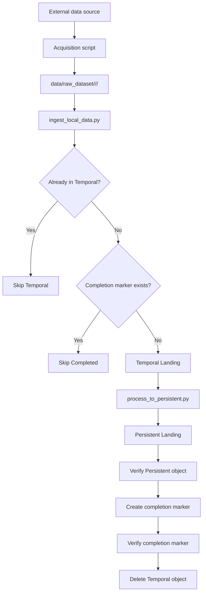

# EcoSentinel — Landing Zone Documentation

> Status: **Image acquisition and the common Landing contract are implemented and validated.**
>
> This document explains the current Landing Zone design, how data moves through it, the decisions behind the implementation, the expected contract for future audio/text acquisition scripts, and the main limitations of the current approach.

---

## 1. Purpose

EcoSentinel is a multimodal wildlife data platform focused on Iberian fauna. The pipeline is designed to ingest raw assets from different sources and modalities while preserving traceability and allowing future processing through the Formatted, Trusted and Exploitation zones.

The Landing Zone is the entry point of the data management backbone. Its responsibilities are intentionally limited to:

1. acquiring raw source data;
2. storing raw assets temporarily;
3. attaching the minimum metadata required for organization and traceability;
4. moving successfully ingested assets to a persistent raw repository;
5. supporting incremental and repeatable ingestion.

The Landing Zone **does not perform data-quality cleaning or duplicate removal**. Those operations belong to the Trusted Zone.

---

## 2. Current status

The following components are currently considered complete for the image modality:

- Wikimedia Commons image acquisition;
- local raw dataset organization;
- acquisition metadata generation;
- Temporal Landing ingestion;
- Persistent Landing processing;
- completion-control registry;
- incremental ingestion;
- recovery/backfill for assets persisted before the control registry existed;
- end-to-end testing with the complete image dataset.

Current validated image dataset:

- 10 wildlife species;
- 10 images per species;
- 100 local raw images;
- 100 Persistent Landing image objects after processing;
- 100 completion markers after processing;
- Temporal Landing empty after successful processing.

The same Temporal and Persistent scripts are designed to be reused by future **audio** and **text** acquisition scripts.

---

## 3. Landing Zone architecture



The MinIO Landing bucket is logically divided into:

```text
landing-zone/
├── temporal_landing/
├── persistent_landing/
└── _control/
    └── completed/
```

`temporal_landing/` may disappear from the MinIO UI when it contains no objects. This is normal S3/MinIO behavior: folders are logical key prefixes rather than physical directories.

---

## 4. Local raw-data contract

The project intentionally uses the following local structure:

```text
data/raw_dataset/
├── images/
│   └── <species_id>/
│       ├── <asset files>
│       └── _metadata.json
├── audio/
│   └── <species_id>/
│       ├── <asset files>
│       └── _metadata.json
└── text/
    └── <species_id>/
        ├── <asset files>
        └── _metadata.json
```

### Why this structure is accepted

The ingestion script is intentionally coupled to the agreed local folder contract:

```text
<modality>/<species_id>/<file>
```

This was kept because:

- it is simple for a local academic pipeline;
- it makes manual inspection easy;
- modality and species can be derived deterministically;
- the project supervisor confirmed that this coupling is acceptable;
- removing the coupling would require an additional global manifest or asset registry without providing meaningful value at the current project scale.

The local structure is therefore a **documented contract**, not an accidental dependency.

---

## 5. Common acquisition contract

Every acquisition script must produce:

1. a raw asset under the correct modality/species directory;
2. a `_metadata.json` file next to the acquired assets;
3. at minimum, a metadata record that can associate the local filename with its source.

The minimum common fields are:

| Field | Purpose |
|---|---|
| `local_filename` | Associates the metadata record with the local asset |
| `source_name` | Identifies the original source |
| `species_id` | Stable EcoSentinel species identifier |

The current image acquisition records also contain:

| Field | Purpose |
|---|---|
| `scientific_name` | Human-readable scientific taxonomy |
| `commons_title` | Wikimedia source record identifier/title |
| `source_url` | Provenance |
| `original_filename` | Original source filename |
| `mime_type` | Technical format |
| `width` / `height` | Image dimensions |
| `file_size_bytes` | Source asset size |
| `license` / `license_url` | Reuse information |
| `creator` / `credit` | Attribution |
| `sha256` | Full local content checksum |

Audio and text acquisition scripts may add modality-specific metadata, but must preserve the common fields required by Landing.

---

## 6. Image acquisition — Wikimedia Commons

Script:

```text
landing_zone/data_acquisition/download_wikimedia_images.py
```

### Responsibilities

The script:

- reads species from `config/species.yaml`;
- queries Wikimedia Commons by scientific species name;
- retrieves technical information and licensing/provenance metadata;
- accepts JPEG, PNG and WEBP;
- applies a minimum long-side resolution;
- applies a maximum file-size threshold;
- downloads raw files without format conversion;
- computes a full SHA-256 checksum;
- saves `_metadata.json`;
- supports repeated execution;
- uses retry logic for temporary HTTP/API failures;
- persists metadata immediately after each successful asset;
- recovers metadata for an already existing local asset when possible;
- sanitizes filenames for Windows compatibility;
- limits local filename length while preserving the extension.

### Why files remain raw

The acquisition layer preserves source files rather than converting them. Format homogenization belongs to the Formatted Zone. This maintains a reproducible copy of the original acquired information.

### Why acquisition metadata is stored immediately

Metadata is written after each successful asset rather than only at the end of a species batch. This reduces the chance of ending with valid files that lack provenance if the process is interrupted.

### Why SHA-256 is calculated here

The checksum provides technical traceability and a stable fingerprint of the exact bytes downloaded.

It is **not** used here as a data-quality deduplication decision.

Two visually identical images can have different hashes after resizing/recompression, while two files with identical bytes have the same hash. Quality-oriented duplicate handling remains a Trusted Zone responsibility.

---

## 7. Temporal Landing

Script:

```text
landing_zone/temporal_landing/ingest_local_data.py
```

### Asset discovery

The script recursively discovers assets in:

```text
data/raw_dataset/<modality>/<species_id>/
```

Supported modalities:

```text
images
audio
text
```

`_metadata.json` files are ignored because they are acquisition-side auxiliary information, not multimodal assets.

### Temporal key convention

Each raw asset is uploaded as:

```text
temporal_landing/<hash16>__<original_local_filename>
```

Example:

```text
temporal_landing/07c5c9dbf9959468__wild_boar.jpg
```

`hash16` is the first 16 hexadecimal characters of the SHA-256 checksum computed from the raw bytes.

### Why the filename is also part of the key

The key deliberately uses:

```text
content hash + filename
```

instead of only the content hash.

This preserves the distinction between:

- same bytes + same filename → same technical ingestion asset;
- same bytes + different filename → different ingestion asset;
- same filename + different bytes → different ingestion asset.

This prevents Landing from becoming a data-quality deduplication layer.

### Temporal object metadata

Each uploaded object contains the minimum metadata required by Persistent Landing:

```text
modality
species_id
source_name
```

`source_name="unknown"` is rejected. Missing provenance is treated as an ingestion error instead of allowing an incomplete asset to move farther into the pipeline.

### Content type

The script infers the MIME type from the filename using Python's `mimetypes` module. Unknown formats use:

```text
application/octet-stream
```

---

## 8. Incremental ingestion and completion control

### Problem

A Temporal object is deleted after it has successfully reached Persistent Landing.

Therefore, checking only:

```text
Does this object currently exist in Temporal?
```

is insufficient.

Without an additional mechanism:

```text
raw
→ Temporal
→ Persistent
→ Temporal deleted

run ingestion again

raw
→ Temporal again
→ another Persistent version
```

This would create artificial re-ingestions of unchanged source assets.

### Alternatives considered

Several approaches were considered:

1. allow re-ingestion and let Trusted remove duplicates;
2. make `ingest_local_data.py` scan Persistent Landing;
3. keep a local JSON ingestion-state file;
4. use a database such as SQLite;
5. create a dedicated control registry in MinIO.

The selected solution is a **MinIO completion registry**.

---

## 9. Completion registry design

Completed Landing ingestions are recorded under:

```text
_control/completed/
```

Each successful asset receives a marker:

```text
_control/completed/<control_id>.json
```

### Control ID

The identifier is:

```text
SHA256(full Temporal object key)
```

For example:

```text
Temporal key:
temporal_landing/07c5c9dbf9959468__wild_boar.jpg

Control key:
_control/completed/2942e2cc...<64 hex characters>.json
```

A complete SHA-256 is used for the control ID because the value is purely internal and there is no need to shorten it.

### Why hash the complete Temporal key

The Temporal key already encodes both:

```text
content hash + filename
```

Therefore:

```text
same bytes + same filename
→ same control ID
→ skip re-ingestion

same bytes + different filename
→ different control ID
→ both may enter Landing

same filename + different bytes
→ different control ID
→ new content may enter Landing
```

This is **idempotence**, not dataset deduplication.

### Marker content

A marker records operational traceability such as:

```json
{
  "temporal_key": "temporal_landing/<hash>__<filename>",
  "persistent_key": "persistent_landing/...",
  "modality": "images",
  "species_id": "sus_scrofa",
  "source_name": "wikimedia_commons",
  "asset_hash": "<hash16>",
  "original_filename": "<filename>",
  "completed_at": "<UTC ISO timestamp>"
}
```

Markers are control-plane metadata. They are not part of the dataset itself.

---

## 10. Why the registry was chosen

The registry was chosen instead of making Temporal scan Persistent.

### Benefits

**Separation of responsibilities**

`ingest_local_data.py` does not need to understand the organization or naming convention of Persistent Landing.

It only asks:

```text
Has this ingestion asset already completed Landing?
```

**Direct lookup**

The control key is deterministic, so the ingestor can perform a direct MinIO object lookup.

It does not need to list Persistent objects and inspect them one by one.

**Independent from future zones**

Formatted, Trusted and Exploitation never need to be queried to decide whether a raw asset already completed Landing.

**Shared state**

Unlike a local JSON file, the registry lives in MinIO and is therefore shared by all team members using the same environment.

**Failure recovery**

The marker makes it possible to distinguish a completed ingestion from an object that merely disappeared from Temporal.

### Cost / limitation

The design introduces additional operational metadata that must remain consistent with the Landing process.

To reduce this risk, markers are created only after the corresponding Persistent object has been verified.

---

## 11. Persistent Landing

Script:

```text
landing_zone/persistent_landing/process_to_persistent.py
```

### Organization

Persistent objects are organized as:

```text
persistent_landing/<modality>/<species_id>/<filename>
```

Example:

```text
persistent_landing/images/sus_scrofa/
```

### Naming convention

Persistent filenames follow:

```text
<source>$<species>$<ingestion_timestamp>$<hash>.<extension>
```

Example:

```text
wikimedia_commons$sus_scrofa$05-10-2026_15-29-36$07c5c9dbf9959468.jpg
```

### Why source is included

The source is visible directly from the object key, improving traceability and automated exploration.

### Why species is included

Species is one of the primary dimensions used by EcoSentinel and makes browsing and downstream processing straightforward.

### Why timestamp is included

The timestamp represents the time at which the asset originally entered Temporal Landing.

It is derived from the Temporal object's `LastModified`, not from the later copy operation.

This ensures that the timestamp describes **ingestion time**, not processing time.

### Why UTC is used

UTC avoids ambiguity between machines, local time zones and daylight-saving changes.

### Why the hash is included

The hash gives a compact technical fingerprint and helps trace a Persistent object back to its Temporal identity.

---

## 12. Safe Temporal → Persistent processing

The final processing order is intentionally:

```text
1. Read Temporal object
2. Validate required metadata
3. Build Persistent key
4. Copy raw bytes to Persistent
5. Verify Persistent object exists
6. Create completion marker
7. Verify completion marker exists
8. Delete Temporal object
```

The raw content is not transformed during this operation.

### Why deletion is last

Temporal is only deleted after both:

```text
Persistent object exists
AND
completion marker exists
```

This prevents data loss if copying or marker creation fails.

### Recovery cases

The process is designed to tolerate partial previous executions.

**Persistent exists, marker missing**

The marker can be created and the Temporal object can then be removed safely.

**Marker exists, Temporal still exists**

The asset is already considered completed; the remaining Temporal copy can be cleaned up.

---

## 13. Backfill of historical Persistent objects

The completion registry was introduced after one image had already been processed to Persistent Landing.

Rather than moving/reprocessing that object manually, the Persistent script provides a control-registry backfill operation:

```bash
python landing_zone/persistent_landing/process_to_persistent.py --backfill-control
```

The backfill reconstructs the original Temporal identity from metadata already stored on the Persistent object and creates the corresponding completion marker.

This preserves reproducibility and avoids manual manipulation of MinIO.

---

## 14. Incremental behavior summary

For each local asset, `ingest_local_data.py` follows:

```text
Build Temporal key
      |
      v
Exists in Temporal?
  Yes → SKIP TEMPORAL
  No
      |
      v
Completion marker exists?
  Yes → SKIP COMPLETED
  No
      |
      v
Upload to Temporal
```

This means repeated executions are safe.

`max_uploads` limits only newly uploaded objects. Skipped objects do not consume the upload limit.

---

## 15. Relationship with Trusted deduplication

The completion registry must not be confused with duplicate detection.

### Landing asks

```text
Have we already completed this exact technical ingestion?
```

### Trusted asks

```text
Should multiple dataset assets be considered duplicates from a quality perspective?
```

Examples:

| Case | Landing | Trusted |
|---|---|---|
| Same bytes, same filename, repeated run | Skip completed | Not relevant |
| Same bytes, different filename | Allow both | Exact duplicate candidate |
| Visually similar but recompressed images | Allow both | Near-duplicate candidate |
| Same filename but changed bytes | Allow as new content | Evaluate normally |

This separation keeps each zone responsible for one type of problem.

---

## 16. Programmatic MinIO interaction

All data movement is performed programmatically through the S3-compatible API using `boto3`.

The MinIO web UI is used only for visual inspection and debugging.

No pipeline step requires manually dragging, renaming or deleting objects through the UI.

---

## 17. Validation performed

The current image pipeline has been tested incrementally rather than only with a single full execution.

Validated cases include:

- local dataset count and metadata consistency;
- Temporal upload of a controlled number of objects;
- detection of pre-existing Temporal objects;
- rejection/cleanup of legacy objects with `source_name="unknown"`;
- Persistent processing of a single test object;
- verification that Temporal objects are deleted after safe persistence;
- backfill of the historical Persistent object;
- direct completion-marker lookup;
- full image ingestion;
- full Temporal → Persistent processing;
- repeated Wikimedia acquisition execution;
- Windows filename-length issue and mitigation.

After full image processing, Temporal is expected to contain no image objects, while Persistent and `_control/completed/` contain one object per completed image ingestion.

---

## 18. Commands

### Start infrastructure

```bash
docker compose up -d
```

### Download all configured Wikimedia images

```bash
python landing_zone/data_acquisition/download_wikimedia_images.py --limit 10
```

### Download/test one species

```bash
python landing_zone/data_acquisition/download_wikimedia_images.py \
  --species timon_lepidus \
  --limit 10
```

### Ingest local raw data into Temporal

```bash
python landing_zone/temporal_landing/ingest_local_data.py
```

### Process Temporal into Persistent

```bash
python landing_zone/persistent_landing/process_to_persistent.py
```

### Dry-run Persistent processing

```bash
python landing_zone/persistent_landing/process_to_persistent.py --dry-run
```

### Process a limited number of Temporal objects

```bash
python landing_zone/persistent_landing/process_to_persistent.py --max-items 1
```

### Backfill completion markers

```bash
python landing_zone/persistent_landing/process_to_persistent.py --backfill-control
```

---

## 19. Contract for audio and text contributors

Future acquisition scripts should **not modify** the common Temporal/Persistent scripts unless a genuine common requirement is discovered.

An audio acquisition script should output:

```text
data/raw_dataset/audio/<species_id>/
├── <audio files>
└── _metadata.json
```

A text acquisition script should output:

```text
data/raw_dataset/text/<species_id>/
├── <text files>
└── _metadata.json
```

At minimum, every record should include:

```text
local_filename
source_name
species_id
```

Useful modality-specific fields should be added when available.

Examples:

**Audio**

```text
source_record_id
duration
sample_rate
recordist
license
source_url
```

**Text**

```text
source_record_id
title
language
license
source_url
```

The common scripts already recognize:

```text
images
audio
text
```

as supported modalities.

---

## 20. Main design trade-offs and limitations

### Local folder structure is part of the contract

The ingestion script relies on:

```text
<modality>/<species_id>/<file>
```

This reduces flexibility but keeps the project simple and understandable.

For a production-scale ingestion platform, a source-independent manifest or catalog would be preferable.

### Temporal uses only 16 hexadecimal SHA-256 characters

This makes object keys shorter and readable.

A truncated fingerprint theoretically has a higher collision probability than full SHA-256. At the scale of this academic project, the risk is negligible, but a large production platform would likely retain the complete hash or use a dedicated asset identifier.

### Completion registry requires consistency

Markers must only represent successfully persisted assets.

The implementation mitigates this by verifying the Persistent object before marker creation and verifying the marker before deleting Temporal.

### Wikimedia category membership is not semantic quality assurance

Technical filters guarantee file type, resolution and size, but do not guarantee that every result is an ideal wildlife photograph.

Illustrations, historical images or other semantically less useful assets may still be present. Semantic quality analysis/curation should be handled explicitly before or within the Trusted Zone according to the final project design.

### Local raw data is not committed to Git

Raw assets are intentionally kept outside version control because they are binary data rather than source code.

Reproducibility comes from acquisition scripts, source metadata and configuration.

---

## 21. Definition of Done for a Landing script

A Landing component is considered complete when:

- it works with real source data;
- it can be re-executed safely;
- expected errors are handled;
- required provenance is present;
- it does not manually move MinIO objects;
- responsibilities are limited to its pipeline stage;
- functions contain meaningful docstrings/comments;
- execution commands are documented;
- important design choices are recorded in the project documentation;
- another team member can run and understand it.

---

## 22. What is frozen and what is still pending

### Frozen unless a real integration issue appears

```text
download_wikimedia_images.py
ingest_local_data.py
process_to_persistent.py
Landing completion registry design
Local Landing folder contract
Persistent naming convention
```

### Pending

```text
Audio acquisition
Text acquisition
Formatted Zone
Trusted Zone
Exploitation Zone
Multimodal tasks
Final orchestration
Final README / report integration
```

---

## 23. Short explanation for presentation

A concise explanation of the Landing design:

> EcoSentinel preserves acquired assets in raw form and sends all modalities through a common Landing path. Temporal Landing acts as a transient buffer, while Persistent Landing stores organized and traceable raw versions using source, species, ingestion timestamp and a technical hash. Incremental ingestion is implemented through deterministic completion markers in MinIO. This avoids coupling the ingestor to Persistent storage layout while keeping data-quality duplicate detection as a separate Trusted Zone responsibility.

